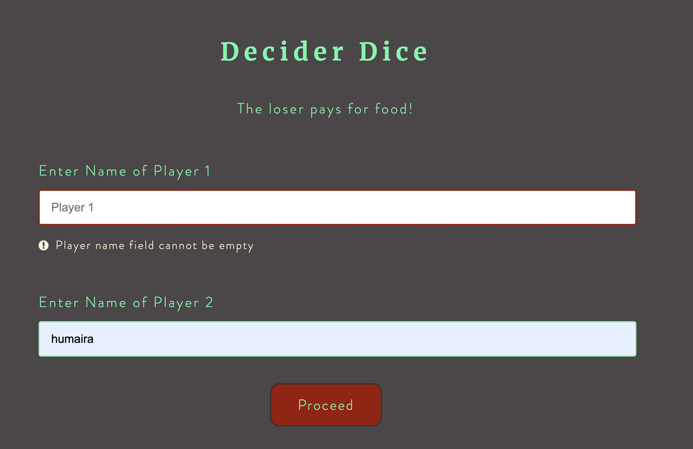
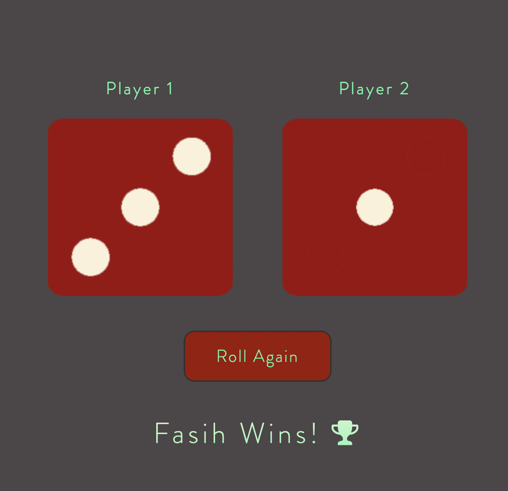
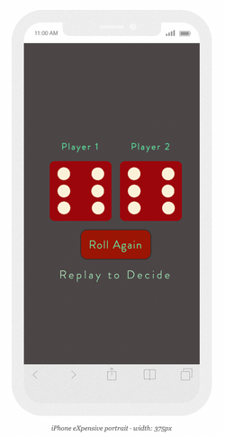
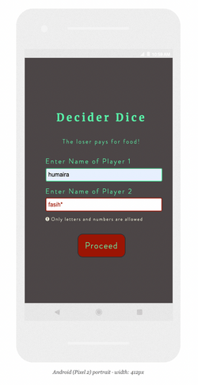

# Decider Dice

## About
This is a mini two-player game that chooses a winner based on dice rolls. 

__Note:__ _It can be used to solve your food disputes!_
 
## Table of contents

- [Screenshots](#screenshots)
- [Project Link](#link-to-project)
- [Libraries & Technologies Used](#libraries-&-technologies-used)
- [Concepts Used](#concepts-used)
- [Reflections](#reflections)
- [Future Plans](#future-plans)

## Screenshots
Laptop Screens |
:-:

iPhone      |  Android
:----------:|:----------:
 | 

## Link to Project

The Project is hosted on GitHub Pages. 
[View Project](https://humairafasih.github.io/DeciderDice/).

## Libraries & Technologies Used

- Semantic HTML5 markup
- CSS3
- VanillaJS
- jQuery

## Concepts Used

- CSS Flexbox, Pseudo-classes, and Media Queries
- HTML5 form validation
- JS Constraint Validation API
- DOM manipulation
- URL API (URLSearchParams interface)
- Adding Custom fonts & favicons

## Reflections

This project was yet another endeavour to practice website structure and styling with HTML & CSS. However, the main intent was to expand my knowledge of the functionalities that JavaScript offers, understand its syntax and best practices, research and use methods and attributes associated with different JavaScript objects, and learn to incorporate basic interactivity into websites using event Handlers with correct logic.    
Initially, this game consisted of only the page with dice images and Play button. I extended the project scope to include custom client-side form validation using HTML5's constraint control attributes ('required' and 'pattern'), JavaScript's Constraint Validation API, and CSS pseudo-classes. While this was a great learning opportunity to dive deeper into pure JS, I realised how a framework like React may be more convenient and offer better performance for adding validation.    

## Future Plans

Based on the takeaways from this project, I plan to build more complex layouts using CSS Flexbox and Grid, dive deeper into functions and objects in JavaScript, and learn a JS framework. 
